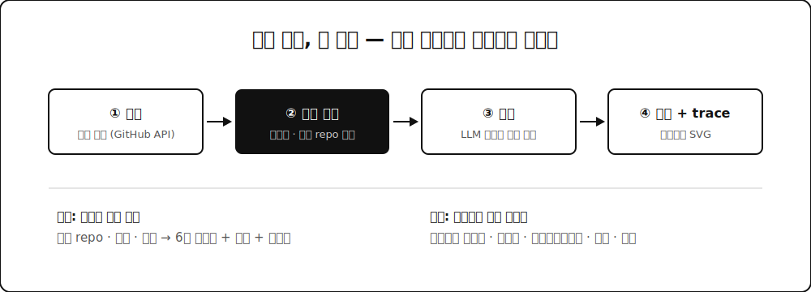

GitHub 프로필 README에 붙이는 위젯들 있잖아요. 잔디 통계, 언어 비율 같은 것들요. 그걸 보다가 이런 생각이 들었습니다. 어차피 개발자 활동을 요약할 거면 RPG 스탯창처럼 만들면 재밌지 않을까? 레벨이 있고 클래스가 있고 능력치 6축이 있는 걸로요. 그래서 만든 게 **ai-stat-sheet**입니다. GitHub 활동을 채점해서 RPG식 스탯 카드 SVG를 만들어주는 도구예요.

## 🎲 재미로 시작했지만 원칙은 진지하게

이런 장난감의 함정은 점수가 아무 근거 없이 나온다는 겁니다. LLM한테 "이 사람 백엔드 실력 점수 매겨줘" 하면 그럴듯한 숫자가 나오긴 해요. 그런데 왜 그 점수인지 아무도 설명 못 합니다.

그래서 원칙을 하나 박았습니다. **증거 없으면 스탯 없음.** 채점은 결정론 코드가 합니다. GitHub API로 공개 저장소, 언어, 스타, 최신성, 토픽을 수집하고 AI/ML·Backend·Frontend·Infra/DevOps·Systems·Activity 여섯 축으로 가중 합산해서 0~100 점수와 레벨을 뽑아요. 그리고 모든 점수에는 근거가 된 저장소 목록이 따라붙습니다. Infra 점수가 왜 이만큼인지 물으면 어느 repo들 때문인지 바로 보여줄 수 있어요.

LLM은 어디에 쓰냐면, 보강에만 씁니다. OPENAI_API_KEY가 있으면 클래스명("풀스택 연금술사" 같은 것)과 한줄평을 생성하는데, 이때도 생성된 내용이 채점 근거에 비춰 말이 되는지 검증을 거쳐요. 키가 없으면 자동 폴백이라 LLM 없이도 완전히 동작합니다. 숫자는 코드가, 수사는 LLM이. 요즘 만드는 것마다 이 분업이 반복되네요.

## 🖼️ README 임베드라는 제약

출력이 SVG인 건 GitHub README에 그대로 붙이기 위해서인데요. 여기 제약이 은근히 빡빡합니다. GitHub은 README의 이미지를 camo라는 프록시로 서빙하면서 외부 리소스 로딩과 스크립트를 다 막아요. 그래서 카드 SVG는 외부 폰트도, 외부 이미지도, 스크립트도 없이 완전히 자기 완결로 렌더되게 만들었습니다. 라이트/다크 테마도 지원하고요.

붙이는 방법은 두 가지입니다. CLI로 생성한 SVG를 프로필 repo에 커밋하는 정적 방식이 제일 간단하고, 항상 최신을 원하면 Vercel 서버리스 엔드포인트를 배포해서 이미지 URL로 임베드하면 됩니다. 6시간 캐시를 걸어서 API 한도도 아껴요.

## 🧭 진짜 목적 — 이건 에이전트 평가의 MVP다

사실 이 프로젝트에는 숨은 목적이 있습니다. 구조를 보면 도구 호출(수집) → 증거 채점 → 검증 → 렌더에 실행 trace까지 남기는 파이프라인인데요. 이 골격에서 "개발자"를 "AI 에이전트"로 바꾸면 그대로 에이전트 평가 하네스가 됩니다. 도구 사용 정확도, 성공률, 에스컬레이션율, 지연, 비용 같은 에이전트의 능력치를 스탯창으로 보는 거죠.

말하자면 스탯 카드는 그 하네스의 프레젠테이션 레이어를 먼저 떼어 만든 MVP예요. 재밌는 껍데기부터 만들어서 검증하고 엔진은 진지한 용도로 확장하는 순서인데, 사이드 프로젝트를 본업 역량과 잇는 방법으로 꽤 괜찮았다고 생각합니다.

## 🎁 정리

한계도 분명합니다. 공개 GitHub만 보니까 사내 비공개 작업은 반영이 안 되고 채점은 어디까지나 활동 분포의 요약이지 절대평가가 아니에요. 그래도 "증거 없으면 스탯 없음" 원칙 덕분에 장난감치고는 떳떳한 숫자를 냅니다. 코드는 GitHub(DevMinGeonPark/ai-stat-sheet)에 있어요. node cli.js 아이디 한 줄이면 본인 스탯창을 뽑아볼 수 있습니다.
