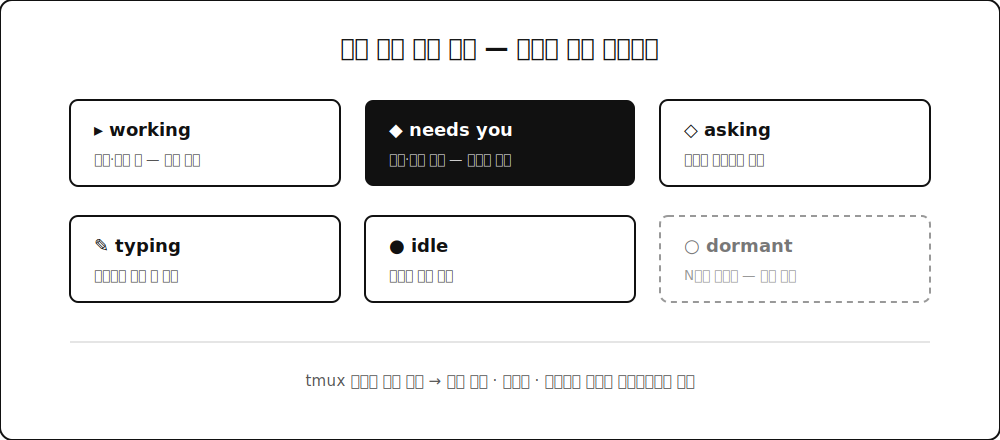

헤드리스 서버에서 Claude Code 세션을 tmux로 여러 개 굴리다 보면 공통의 고통이 생깁니다. 어느 세션이 일하는 중이고 어느 세션이 조용히 제 대답을 기다리고 있고 어느 세션을 며칠째 잊고 있었는지 알 수가 없어요. tmux ls가 알려주는 건 세션 이름과 생성 시각뿐이거든요. 붙어보기 전엔 모릅니다. 그래서 만든 게 **amux**입니다. 에이전트를 아는 tmux 세션 매니저예요.

## 👀 핵심 아이디어 — 세션의 화면을 읽는다

tmux는 각 세션의 현재 화면을 텍스트로 뽑아주는 기능이 있습니다. amux는 이걸로 세션마다 라이브 화면을 읽어서 상태를 여섯 가지로 라벨링해요.

**working**은 에이전트가 생성하거나 명령을 돌리는 중. **needs you**는 권한 확인이나 선택지 박스가 떠서 제 대답 전까지 막혀 있는 상태. **asking**은 에이전트의 마지막 메시지가 질문이라 프롬프트에서 기다리는 상태. **typing**은 제가 입력창에 쓰다 만 초안이 남아 있는 상태. **idle**은 조용히 대기, **dormant**는 며칠째 활동이 없는 잊힌 세션입니다.

이 중에 제일 아픈 건 needs you인데요. 에이전트가 10분째 권한 승인 하나를 기다리고 있는데 저는 다른 세션에서 신나게 일하고 있는 경우가 진짜 많거든요. 그래서 amux 목록에선 needs you 세션이 맨 위로 떠오르고 요약 줄에 경고로 따로 표시됩니다.

## 🗂️ 구조 — 태그로 묶고, 피커로 본다

세션 이름은 tag/name 규칙을 씁니다. api/server, web/ui 같은 식이에요. 목록은 태그별로 묶이고 태그마다 색 칩이 붙어서 프로젝트 단위로 한눈에 들어옵니다.

인터페이스는 세 개입니다. amux를 치면 그룹된 목록이 나오고 amux pick은 fzf 기반 라이브 피커를 엽니다. 피커 오른쪽 창에는 선택한 세션의 실제 화면이 실시간으로 뜨는데, 붙지 않고도 에이전트가 뭘 하는지 구경할 수 있어요. 단축키로 새 세션 생성, 태그 변경, 세션 킬까지 피커 안에서 해결됩니다. amux watch는 전체 화면 대시보드로, 자동 갱신되면서 모든 세션 상태를 보여줘요.

원격 서버라 SSH 로그인 시 피커가 자동으로 뜨는 옵션도 넣었습니다. 접속하자마자 "지금 나를 기다리는 세션"부터 보이는 게 원격 워크플로에선 꽤 큽니다.

## 🧪 구현 — 순수 Bash의 제약

구현은 순수 Bash와 tmux뿐입니다. 의존성을 안 깔아도 어디서든 돌아가야 해서요. fzf가 있으면 라이브 피커를 쓰고 없으면 번호 메뉴로 폴백합니다.

고생한 지점은 macOS였는데요. macOS 기본 bash가 3.2라서(2007년 물건입니다) 연관 배열 같은 현대 문법을 못 씁니다. 상태 감지도 까다로웠어요. Claude Code와 Codex는 화면 구성이 다르고 버전마다 UI 문구도 바뀌니까, 특정 문자열 매칭에 과하게 기대면 업데이트마다 깨집니다. 그래서 패턴을 여러 겹으로 두고 제일 확실한 신호(선택 박스, 스피너, 프롬프트 상태)부터 순서대로 판정하게 했어요.

## 🎁 정리

만들고 나서 세션 수가 오히려 늘었습니다. 관리가 되니까 부담 없이 늘리게 되더라구요. 지금은 SSH로 붙으면 피커가 뜨고 needs you부터 처리하고 dormant를 정리하는 게 아침 루틴이 됐습니다. 에이전트 여러 개를 동시에 굴리는 분이라면 GitHub(DevMinGeonPark/amux)에서 받아서 써보세요. install.sh 하나면 됩니다.
