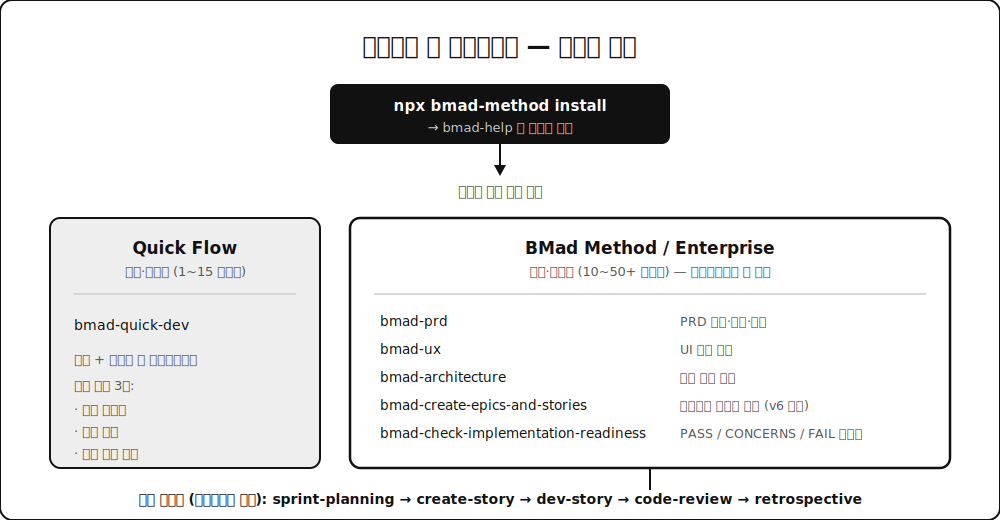

방법론 하네스를 조사하다가 **BMAD-METHOD**를 다시 열어봤습니다. 별 5만 개, 포크 5.8천 개. AI 개발 방법론 프레임워크 중에선 사실상 최대 규모예요.

솔직히 말하면 저는 이 도구에 대해 이미 결론을 내려놓고 있었습니다. 몇 달 전 조사 때 "고정된 애자일 페르소나 프레임워크, 순수 자문형, 토큰 비용이 부담"이라고 정리해뒀거든요. 그런데 이번에 v6 저장소를 실제로 파보니 그 메모가 꽤 낡아 있었습니다. 구조가 통째로 바뀌었더라구요.

그래서 이 글은 좀 깁니다. 앞부분은 BMAD가 뭘 파는 도구인지, 중간은 **설치부터 첫 스토리 구현까지 실제 사용법**, 뒷부분은 커스터마이징과 제 비판입니다. 필요한 데부터 읽으셔도 돼요.

## 🎭 BMAD가 파는 것 — "대신 생각해주지 않는다"

README의 첫 주장이 인상적이었는데요. 이렇게 적혀 있습니다. "전통적인 AI 도구는 당신 대신 생각해서 평균적인 결과를 낸다. BMad의 에이전트는 당신의 최선을 끌어내는 구조화된 과정을 안내하는 전문가 동료다."

이게 마케팅 문구만은 아닙니다. PRD 작성 스킬 내부를 열어보면 이런 지시가 박혀 있어요.

> 사용자가 Fast path를 고르지 않는 한, 대신 생각해주고 싶은 충동과 싸워라.
>
> 발굴이지 지시가 아니다. 당신이 웨지를 이름 붙이거나 MVP 범위를 자르거나 단계를 제안하고 있다면 멈춰라 — 발굴에서 저술로 넘어간 것이다. 펜을 돌려줘라.

LLM에게 "너무 잘 해주지 마라"라고 지시하는 프롬프트는 처음 봤습니다. 보통은 반대로 쓰거든요. 이 도구의 철학이 여기 다 담겨 있다고 봐요. 문서를 뽑아주는 기계가 아니라 **당신을 인터뷰하는 퍼실리테이터**를 지향합니다.

## 🧱 전체 지도 — 4단계와 3개 트랙

BMAD의 뼈대는 네 단계입니다.

**Phase 1 분석**(선택) — 브레인스토밍, 아이디어 단조(forge-idea), 시장·기술·도메인 리서치, 제품 브리프, PRFAQ(아마존의 Working Backwards 방식). 아이디어를 싸게 죽이거나 굳히는 단계예요.

**Phase 2 기획** — PRD, UX 설계, 그리고 SPEC. PRD 스킬 하나가 생성·수정·검증 세 가지 의도를 다 처리합니다.

**Phase 3 설계** — 아키텍처 결정, 에픽과 스토리 분해, 그리고 구현 준비도 게이트(PASS/CONCERNS/FAIL 판정).

**Phase 4 구현** — 스프린트 계획, 스토리 생성, 구현, 코드 리뷰, 코스 교정, 회고.

그런데 모든 프로젝트가 이 전 과정을 다 타는 건 아닙니다. 규모에 따라 세 트랙으로 갈려요.

| 트랙 | 적합한 경우 | 만드는 문서 |
|---|---|---|
| **Quick Flow** | 버그 수정, 단순 기능, 범위가 명확 (스토리 1~15개) | 기술 스펙만 |
| **BMad Method** | 제품, 플랫폼, 복잡한 기능 (10~50+) | PRD + 아키텍처 + UX |
| **Enterprise** | 컴플라이언스, 멀티테넌트 (30+) | PRD + 아키텍처 + 보안 + DevOps |

공식 문서가 "스토리 개수는 정의가 아니라 참고치다. 계산이 아니라 기획 필요에 따라 트랙을 고르라"고 못 박아둔 게 마음에 들었어요.



## 🚀 튜토리얼 1 — 설치와 첫 실행

준비물은 Node.js 20.12+, Python 3.10+, uv, 그리고 Claude Code나 Cursor 같은 AI IDE입니다.

프로젝트 폴더에서 설치합니다.

```bash
npx bmad-method install
```

프롬프트가 뜨면 모듈에서 **BMad Method**를 고르세요. CI에서 돌리거나 반복 설치가 필요하면 비대화식으로도 됩니다.

```bash
npx bmad-method install --directory /path/to/project \
  --modules bmm --tools claude-code --yes \
  --set bmm.user_skill_level=expert \
  --set bmm.project_knowledge=research
```

`--set`은 모듈 설정을 덮어쓰는 옵션이고 반복해서 줄 수 있어요. `--list-options bmm`으로 어떤 키가 있는지 볼 수 있습니다. 설치 중에 개발 경험 수준(beginner/intermediate/expert)을 묻는데, 이건 에이전트가 채팅에서 개념을 얼마나 풀어 설명할지를 정합니다.

설치가 끝나면 폴더 두 개가 생깁니다.

```text
your-project/
├── _bmad/          # 스킬, 에이전트, 설정
└── _bmad-output/   # 산출물이 쌓일 곳 (처음엔 비어 있음)
```

그다음 할 일은 딱 하나예요. IDE를 열고 이걸 부릅니다.

```
bmad-help
```

이게 BMAD의 안내 데스크입니다. 프로젝트를 스캔해서 뭐가 이미 되어 있는지 보고 설치된 모듈 기준으로 선택지를 보여주고 다음에 뭘 할지 추천해줘요. 질문을 붙여도 됩니다.

```
bmad-help SaaS 아이디어가 있고 원하는 기능도 다 아는데, 어디서 시작하죠?
```

워크플로가 끝날 때마다 자동으로 실행돼서 다음 단계를 알려주기도 합니다. 34개 워크플로를 외울 필요가 없는 이유예요.

## 📝 튜토리얼 2 — 기획 (Phase 2~3)

여기서 가장 중요한 규칙 하나. **워크플로마다 새 채팅을 여세요.** 공식 문서가 반복해서 강조하는데, 이전 세션의 컨텍스트가 남아 있으면 충돌이 납니다.

**PRD 만들기.** 새 채팅에서 `bmad-prd`를 부릅니다. 의도를 말하거나(생성/수정/검증) 스킬이 물어보게 두면 돼요.

- **생성** — 처음부터 코칭 방식으로 발굴
- **수정** — 기존 PRD에 변경 신호를 반영하되, 이전 결정과 충돌하는 지점을 먼저 보여줌
- **검증** — 고치지 않고 체크리스트로 비평만, HTML 리포트 산출

산출물은 `prd.md`, `addendum.md`, 그리고 `.memlog.md`입니다. 이 세 번째 파일이 흥미로운데 뒤에서 다시 얘기할게요.

PRD 대화는 두 갈래로 갈립니다. **Fast path**는 남은 빈칸을 한두 개 질문으로 몰아 묻고 초안을 뽑아준 뒤 추론한 부분에 `[ASSUMPTION]` 태그를 답니다. **Coaching path**는 PM처럼 생각하는 섹션들을 같이 걸어가요. 급할 땐 앞엣것, 제대로 파고 싶을 땐 뒤엣것입니다.

**UX 설계**(UI가 있다면). `bmad-agent-ux-designer`를 부르고 `bmad-ux`를 돌립니다. 시각 명세(DESIGN.md)와 행동 명세(EXPERIENCE.md) 한 쌍이 나와요.

**아키텍처.** 새 채팅에서 `bmad-agent-architect` → `bmad-architecture`. 기술 결정을 명시적으로 남기는 단계입니다.

**에픽과 스토리.** `bmad-agent-pm` → `bmad-create-epics-and-stories`. v6에서 바뀐 지점인데, 스토리 분해를 **아키텍처 다음에** 합니다. DB나 API 패턴 같은 기술 결정이 작업 쪼개는 방식에 직접 영향을 주니까요. 순서를 바꾼 이유가 설득력 있었습니다.

**준비도 게이트**(강력 권장). `bmad-check-implementation-readiness`로 기획 문서들이 서로 아귀가 맞는지 검사하고 PASS/CONCERNS/FAIL을 받습니다.

## 🔨 튜토리얼 3 — 구현 (Phase 4)

먼저 `bmad-agent-dev`를 부르고 `bmad-sprint-planning`을 한 번 돌립니다. `sprint-status.yaml`이 생기면서 에픽과 스토리 추적이 시작돼요.

그다음은 스토리 하나마다 이 사이클을 반복합니다. 매번 새 채팅으로요.

| 순서 | 워크플로 | 하는 일 |
|---|---|---|
| 1 | `bmad-create-story` | 에픽에서 다음 스토리 파일 준비 |
| 2 | `bmad-dev-story` | 구현 (코드 + 테스트) |
| 3 | `bmad-code-review` | 품질 검증 — 승인 또는 수정 요청 |

에픽 하나가 끝나면 `bmad-retrospective`로 회고를 돌립니다. 중간에 범위가 크게 바뀌면 `bmad-correct-course`가 계획을 갱신하거나 경로를 다시 잡아줘요.

전 과정을 다 타기 싫을 때는 **Quick Dev**가 있습니다.

```
bmad-quick-dev
```

버그 수정이나 작은 리팩토링용인데, 설계 철학이 꽤 좋았어요. 사람이 개입하는 순간이 비싸다는 전제에서 출발합니다. 그래서 개입 지점을 세 개로 압축해요. 의도 명확화, 스펙 승인, 최종 결과 리뷰. 그사이엔 모델이 길게 혼자 달립니다.

제일 마음에 든 건 실패 진단 원칙이었습니다. **의도가 틀려서 구현이 틀렸으면 코드를 고치는 건 잘못된 수리**라는 거예요. 스펙이 약해서 코드가 틀렸으면 diff를 고치는 것도 잘못이고요. 리뷰 결과로 문제가 어느 층에서 들어왔는지 판정하고, 그 층으로 돌아가서 다시 생성합니다. 진짜 국소적인 문제만 국소적으로 패치해요.

## 🏚️ 튜토리얼 4 — 기존 프로젝트에 얹기

신규 프로젝트가 아니라 이미 굴러가는 코드베이스라면 순서가 다릅니다.

먼저 완료된 기획 산출물을 정리하래요. 이미 끝난 PRD 에픽과 스토리는 아카이브하거나 지우고 `docs/`나 산출물 폴더에 남기지 말라고 합니다.

그다음이 핵심인데, 프로젝트 컨텍스트를 만듭니다.

```
bmad-generate-project-context
```

코드베이스를 스캔해서 기술 스택과 버전, 코드 구성 패턴, 네이밍 규칙, 테스트 방식, 프레임워크별 관례를 뽑아내요. 이게 `project-context.md`로 남고, 이후 모든 워크플로가 "항상 염두에 두는 사실"로 이 파일을 로드합니다. 에이전트가 기존 관례를 무시하고 자기 스타일로 코드를 짜는 사고를 막는 장치예요.

## 🎉 알아두면 좋은 것들

**파티 모드.** `bmad-party-mode`를 부르면 설치된 에이전트들이 한 방에 모입니다. PM, 아키텍트, 개발자, UX 디자이너가 캐릭터를 유지한 채로 서로 동의하고 반박하고 얹어가요. 문서의 설명이 좋았습니다. "아키텍트는 설계를 지키고, PM은 범위를 지키고, 개발자는 실제로 만들 수 있는지를 지킨다. 같은 방에 넣으면 트레이드오프가 3주 뒤 스프린트가 아니라 지금 이 대화에서 드러난다." 다른 워크플로 도중에도 끼워 부를 수 있습니다.

**심화 발굴.** `bmad-advanced-elicitation`은 특정 섹션을 더 깊게 파고들 때 씁니다. PRD를 쓰다가 한 부분이 얕다 싶으면 부르는 식이에요.

**자동 루프.** `bmad-dev-auto`는 무인 개발 루프의 1회 반복을 담당합니다. 의도 명확화 → 스펙 생성 또는 재개 → 구현 → 리뷰 → 스펙 파일에 종료 상태 기록. 서브에이전트가 없으면 `blocked`로 멈추고, 커밋 안 된 변경이 있으면 아예 시작하지 않아요. 사람이 자리를 비운 사이 돌리는 걸 전제로 설계돼 있습니다.

**웹 번들.** 기획 워크플로(브레인스토밍, PRD, 리서치 등)를 Gemini Gems나 ChatGPT Custom GPT로 패키징해주는 기능입니다. 정액제 구독에서 기획을 끝내고 결과물만 IDE로 가져오라는 거예요. 이게 왜 있는지는 뒤에서 얘기할게요.

## 🎨 튜토리얼 5 — 커스터마이징

여기가 제가 이 도구에서 제일 많이 배운 부분입니다.

각 스킬에는 `customize.toml`이 딸려 오는데, 맨 위에 이렇게 적혀 있어요. **"편집하지 마라 — 업데이트마다 덮어쓴다."** 대신 오버라이드 파일을 따로 만듭니다.

```text
우선순위 1 (승): _bmad/custom/{스킬}.user.toml   개인용, gitignore
우선순위 2:      _bmad/custom/{스킬}.toml        팀/조직용, 커밋
우선순위 3 (기본): 스킬의 customize.toml          배포본
```

병합 규칙이 필드 이름이 아니라 **값의 모양**으로 정해지는 게 인상적이었습니다. 스칼라는 덮어쓰기고 테이블은 깊은 병합입니다. 식별자(`code`나 `id`)를 가진 테이블 배열은 키로 병합해서 같은 키는 교체하고 새 키는 추가하고, 나머지 배열은 이어붙입니다.

제거 메커니즘이 없다는 것도 명시돼 있어요. 오버라이드로 기본 항목을 지울 수는 없고, 정 필요하면 같은 키로 덮어써서 무력화하거나 스킬을 포크하랍니다. 확장은 열되 파괴는 막는 설계죠.


TOML을 직접 쓰기 싫으면 `bmad-customize` 스킬이 대신 써줍니다. 뭘 바꿀 수 있는지 스캔하고, 에이전트용인지 워크플로용인지 골라주고, 파일을 쓰고 병합이 실제로 먹었는지까지 검증해요.

실제로 넣을 만한 것들은 이런 겁니다.

- `persistent_facts` — "우리 조직은 AWS만 쓴다", "투자자용 PRD엔 시장 규모 섹션이 필수다" 같은 항상 기억할 사실. 파일 경로나 다른 스킬도 참조 가능
- `activation_steps_prepend` / `append` — 워크플로 시작 전후에 끼워 넣을 우리 조직 절차 (컴플라이언스 체크 등)
- `on_complete` — 워크플로가 끝났을 때 실행할 것

에이전트 이름과 직함은 읽기 전용이라 오버라이드해도 안 바뀝니다. 이름을 바꾸고 싶으면 스킬 폴더를 복사해서 커스텀 스킬로 만들라고 안내해요.

## 🔄 v6에서 뭐가 달라졌나 — 제 메모가 틀린 지점

이 글을 쓰게 된 이유인데요. 제가 알던 BMAD와 실제 v6는 세 군데에서 달랐습니다.


**첫째, 자문형이 아닙니다.** 예전엔 페르소나가 조언만 해주는 구조였는데, 지금은 스킬이 파이썬 스크립트를 실제로 호출합니다. 아까 나온 `.memlog.md`가 그 예예요. PRD의 모든 결정과 변경과 오버라이드가 `memlog.py`를 거쳐 append-only 감사 로그로 쌓입니다. 손으로 쓰는 게 아니라 원자적 스크립트를 통해서만 쓰게 강제하고, 로그에 안 남은 건 재개할 때 사라져요. 결정을 기록으로 강제하는 이 감각은 제가 [LLM OS](/posts/llm-os/) 글에서 커밋먼트 원장이라고 부른 것과 같은 계열입니다.

**둘째, 규모 적응형입니다.** 세 트랙 얘기를 앞에서 했는데, 스킬 내부에도 "취미/사내/런칭" 세 단계 이해관계 보정이 들어 있고 급한 사용자를 상류 질문으로 붙잡아두지 말라는 지시가 명시돼 있어요. 모든 작업에 같은 무게의 프로세스를 태우는 게 이런 도구들의 고질병인데, 그걸 인지하고 있다는 뜻입니다.

**셋째, 자동화가 있습니다.** 무인 루프(`bmad-dev-auto`)와 서브에이전트 기반 실행이 v6의 축이에요. 예전의 "사람이 페르소나와 대화하는 프레임워크"와는 결이 다릅니다.

## 🧨 그럼에도 불편한 지점

칭찬만 하면 리뷰가 아니니까 짚을 건 짚겠습니다.

**토큰 비용.** 이슈 트래커에 "워크플로의 과도한 토큰 사용", "big tokens cost" 같은 제목이 반복해서 올라옵니다. 메인테이너의 답은 대체로 "서브에이전트를 써라", "dev는 스토리와 파일 3개만 읽게 되어 있다"인데요. 설계 의도가 그렇다는 것과 실사용에서 그렇게 굴러간다는 건 다른 문제입니다. 실제로 어떤 이슈는 리뷰 규칙이 구조적으로 수렴하지 않아서 매 리뷰마다 또 리뷰를 권고한다는 지적이었어요. 무한 루프가 곧 무한 청구서인 워크플로에선 치명적인 버그죠.

**웹 번들이라는 우회로.** 흥미로운 건 프로젝트가 이 비용 문제를 인정하고 우회로를 만들었다는 겁니다. 기획 단계를 정액제 구독에서 돌리고 결과물만 IDE로 가져오라는 조언이 공식 문서에 있다는 건, 뒤집으면 전 과정을 IDE에서 돌리기엔 비싸다는 자백입니다.

**학습 곡선.** 34개 워크플로, 12명 이상의 에이전트, 5개 공식 모듈. 이 규모 자체가 진입 장벽입니다. 프로젝트도 알고 있어서 `bmad-help`를 만들어 뒀지만, 도구를 쓰기 위한 도구가 필요하다는 건 복잡도의 신호이기도 해요.

**새 채팅 규칙의 이면.** 워크플로마다 새 채팅을 열라는 건 컨텍스트 오염을 막는 합리적인 규칙이지만, 동시에 프레임워크가 컨텍스트 연속성을 스스로 관리하지 못한다는 뜻이기도 합니다. 그래서 문서(`.memlog.md`, `project-context.md`)로 연속성을 대신하는 거고요.

## 🎁 그래서 누가 쓰면 좋은가

제 결론은 이렇습니다.

**잘 맞는 경우** — 기획 문서부터 제대로 만들어야 하는 신규 프로젝트, 여러 에이전트를 동시에 굴려서 결정이 충돌하는 팀, 그리고 "AI가 대신 다 해주는 것"보다 "AI가 내 생각을 끌어내는 것"을 원하는 사람. 가볍게 맛보려면 Quick Flow만 써봐도 됩니다. `npx bmad-method install` 하고 `bmad-quick-dev`로 버그 하나 고쳐보는 게 제일 싼 시험이에요.

**안 맞는 경우** — 이미 굴러가는 팀 프로세스가 있는 조직. 이건 BMAD의 잘못이라기보단 구조적인 문제인데, 이 도구는 자기 방법론을 들고 옵니다. 기존 팀 규칙을 AI에 강제해주는 게 아니라 새 프로세스를 배우라고 요구해요. 기업이 새 프로세스를 좀처럼 받아들이지 않는다는 걸 생각하면, 이 지점이 채택의 가장 큰 벽일 겁니다.

개인적으로는 통째로 도입하기보단 설계를 참고할 생각입니다. 3층 오버라이드, 감사 로그 강제, 준비도 게이트, 실패 진단을 층별로 하는 원칙, 그리고 무엇보다 "대신 생각해주지 마라"는 지시문. 이건 제 하네스에 그대로 가져가고 싶네요.

낡은 메모 하나를 고쳤다는 게 이번 조사의 진짜 수확이었습니다. 빠르게 움직이는 생태계에서 몇 달 전 판단은 생각보다 빨리 상해요. [LLM 위키](/posts/llm-wiki/) 글에서 "낡은 정보가 없는 정보보다 위험하다"고 썼는데, 제 위키에도 그런 항목이 있었던 겁니다.
