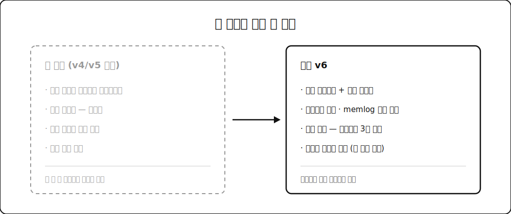
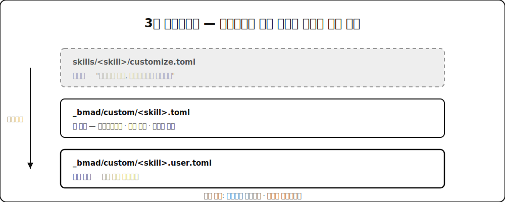

방법론 하네스를 조사하다가 **BMAD-METHOD**를 다시 열어봤습니다. 별 5만 개, 포크 5.8천 개. AI 개발 방법론 프레임워크 중에선 사실상 최대 규모예요.

솔직히 말하면 저는 이 도구에 대해 이미 결론을 내려놓고 있었습니다. 몇 달 전 조사 때 "고정된 애자일 페르소나 프레임워크, 순수 자문형, 토큰 비용이 부담"이라고 정리해뒀거든요. 그런데 이번에 v6 저장소를 실제로 파보니 그 메모가 꽤 낡아 있었습니다. 구조가 통째로 바뀌었더라구요. 그래서 이 글은 BMAD 소개이자, 제 오래된 판단을 갱신하는 기록입니다.

## 🎭 BMAD가 파는 것 — "대신 생각해주지 않는다"

README의 첫 주장이 인상적이었는데요. 이렇게 적혀 있습니다. "전통적인 AI 도구는 당신 대신 생각해서 평균적인 결과를 낸다. BMad의 에이전트는 당신의 최선을 끌어내는 구조화된 과정을 안내하는 전문가 동료다."

이게 마케팅 문구만은 아닙니다. PRD 작성 스킬 내부를 열어보면 이런 지시가 박혀 있어요.

> 사용자가 Fast path를 고르지 않는 한, 대신 생각해주고 싶은 충동과 싸워라.
>
> 발굴이지 지시가 아니다. 당신이 웨지를 이름 붙이거나 MVP 범위를 자르거나 단계를 제안하고 있다면 멈춰라 — 발굴에서 저술로 넘어간 것이다. 펜을 돌려줘라.

LLM에게 "너무 잘 해주지 마라"라고 지시하는 프롬프트는 처음 봤습니다. 보통은 반대로 쓰거든요. 이 도구의 철학이 여기 다 담겨 있다고 봐요. 문서를 뽑아주는 기계가 아니라 **당신을 인터뷰하는 퍼실리테이터**를 지향합니다.

## 🧱 4단계 파이프라인과 34개 워크플로

BMAD의 뼈대는 네 단계입니다.

**Phase 1 분석**(선택) — 브레인스토밍, 아이디어 단조(forge-idea), 시장·기술·도메인 리서치, 제품 브리프, PRFAQ(아마존의 Working Backwards 방식). 아이디어를 싸게 죽이거나 굳히는 단계예요.

**Phase 2 기획** — PRD, UX 설계, 그리고 SPEC. PRD 스킬 하나가 생성·수정·검증 세 가지 의도를 다 처리합니다.

**Phase 3 설계** — 아키텍처 결정, 에픽과 스토리 분해, 그리고 구현 준비도 게이트(PASS/CONCERNS/FAIL 판정).

**Phase 4 구현** — 스프린트 계획, 스토리 생성, 구현, 코드 리뷰, 코스 교정, 회고.

각 단계의 산출물이 다음 단계의 입력이 되는 구조입니다. 문서가 컨텍스트를 점진적으로 쌓아 올려서 에이전트가 "무엇을 왜 만드는지" 항상 알게 한다는 게 공식 설명이에요. 제가 앞선 글에서 쓴 LLM 위키와 문제의식이 겹칩니다.

## 🔄 v6에서 뭐가 달라졌나 — 제 메모가 틀린 지점

여기가 이 글을 쓰게 된 이유인데요. 제가 알던 BMAD와 실제 v6는 세 군데에서 달랐습니다.

**첫째, 자문형이 아닙니다.** 예전엔 페르소나가 조언만 해주는 구조였는데, 지금은 스킬이 파이썬 스크립트를 실제로 호출합니다. PRD 스킬은 모든 결정과 변경과 오버라이드를 `memlog.py`로 append-only 감사 로그에 남겨요. 손으로 쓰는 게 아니라 원자적 스크립트를 거치게 강제하고, 로그에 안 남은 건 재개할 때 사라집니다. 결정을 기록으로 강제하는 이 감각은 제가 LLM OS 글에서 커밋먼트 원장이라고 부른 것과 같은 계열이에요.

**둘째, 규모 적응형입니다.** 버그 수정부터 엔터프라이즈 시스템까지 프로젝트 복잡도에 따라 기획 깊이가 자동 조절된다고 주장합니다. PRD 스킬에도 "취미/사내/런칭" 세 단계 이해관계 보정이 들어 있고, 급한 사용자를 상류 질문으로 붙잡아두지 말라는 지시가 명시돼 있어요. 모든 작업에 같은 무게의 프로세스를 태우는 게 이런 도구들의 고질병인데, 그걸 인지하고 있다는 뜻입니다.

**셋째, 자동화 루프가 있습니다.** `bmad-dev-auto`는 무인 개발 루프의 1회 반복을 담당해요. 의도 명확화 → 스펙 생성 또는 재개 → 구현 → 리뷰 → 스펙 파일에 종료 상태 기록. 서브에이전트가 없으면 `blocked`로 멈추고, 커밋 안 된 변경이 있으면 시작하지 않습니다. 사람이 자리를 비운 사이 돌리는 걸 전제로 설계돼 있어요.

## 🎨 설계에서 배울 만한 것 두 개

도구를 쓸지 말지와 별개로, 설계 자체에서 훔쳐올 만한 게 있었습니다.

**customize.toml의 3층 오버라이드.** 각 스킬에는 커스터마이징 파일이 딸려 오는데, 맨 위에 이렇게 적혀 있어요. "편집하지 마라 — 업데이트마다 덮어쓴다." 대신 팀용 오버라이드 파일과 개인용 오버라이드 파일을 따로 두고, 스칼라는 덮어쓰기고 배열은 이어붙이기라는 병합 규칙을 정해뒀습니다. 도구를 업데이트해도 우리 팀 규칙이 안 날아가는 구조인데, 이게 방법론 도구의 실전 채택에서 결정적인 부분이라고 봅니다.

**activation_steps와 persistent_facts.** 워크플로 시작 전후에 우리 조직의 절차를 끼워 넣을 수 있고, 컴플라이언스 제약이나 코딩 표준 같은 걸 "항상 염두에 두는 사실"로 주입할 수 있어요. 파일 경로나 다른 스킬을 참조하는 것도 됩니다. 확장 지점을 문서화해서 열어둔 거죠.

## 🧨 그럼에도 불편한 지점

칭찬만 하면 리뷰가 아니니까 짚을 건 짚겠습니다.

**토큰 비용.** 이슈 트래커에 "워크플로의 과도한 토큰 사용", "big tokens cost" 같은 제목이 반복해서 올라옵니다. 메인테이너의 답은 대체로 "서브에이전트를 써라", "dev는 스토리와 파일 3개만 읽게 되어 있다"인데요. 설계 의도가 그렇다는 것과 실사용에서 그렇게 굴러간다는 건 다른 문제입니다. 실제로 어떤 이슈는 리뷰 규칙이 구조적으로 수렴하지 않아서 매 리뷰마다 또 리뷰를 권고한다는 지적이었어요. 무한 루프가 곧 무한 청구서인 워크플로에선 치명적인 버그죠.

**웹 번들이라는 우회로.** 흥미로운 건 프로젝트가 이 비용 문제를 인정하고 우회로를 만들었다는 겁니다. 기획 단계(브레인스토밍, PRD, 리서치)를 ChatGPT나 Gemini의 정액제 구독에서 돌리고, 결과물만 IDE로 가져오라는 거예요. 종량제 IDE 토큰 대신 정액제를 쓰라는 조언이 공식 문서에 있다는 건, 뒤집으면 전 과정을 IDE에서 돌리기엔 비싸다는 자백입니다.

**학습 곡선.** 34개 워크플로, 12명 이상의 에이전트, 5개 공식 모듈. 이 규모 자체가 진입 장벽입니다. 프로젝트도 알고 있어서 "다음에 뭘 할지 알려주는" `bmad-help` 스킬을 따로 만들어 뒀어요. 도구를 쓰기 위한 도구가 필요하다는 건 복잡도의 신호이기도 합니다.

## 🎁 그래서 누가 쓰면 좋은가

제 결론은 이렇습니다.

**잘 맞는 경우** — 기획 문서부터 제대로 만들어야 하는 신규 프로젝트, 여러 에이전트를 동시에 굴려서 결정이 충돌하는 팀, 그리고 "AI가 대신 다 해주는 것"보다 "AI가 내 생각을 끌어내는 것"을 원하는 사람.

**안 맞는 경우** — 이미 굴러가는 팀 프로세스가 있는 조직. 이건 BMAD의 잘못이라기보단 구조적인 문제인데, 이 도구는 자기 방법론을 들고 옵니다. 기존 팀 규칙을 AI에 강제해주는 게 아니라 새 프로세스를 배우라고 요구해요. 기업이 새 프로세스를 좀처럼 받아들이지 않는다는 걸 생각하면, 이 지점이 채택의 가장 큰 벽일 겁니다.

개인적으로는 통째로 도입하기보단 설계를 참고할 생각입니다. 3층 오버라이드, 감사 로그 강제, 준비도 게이트, 그리고 무엇보다 "대신 생각해주지 마라"는 지시문. 이건 제 하네스에 그대로 가져가고 싶네요.

낡은 메모 하나를 고쳤다는 게 이번 조사의 진짜 수확이었습니다. 빠르게 움직이는 생태계에서 몇 달 전 판단은 생각보다 빨리 상해요. [LLM 위키](/posts/llm-wiki/) 글에서 "낡은 정보가 없는 정보보다 위험하다"고 썼는데, 제 위키에도 그런 항목이 있었던 겁니다.
