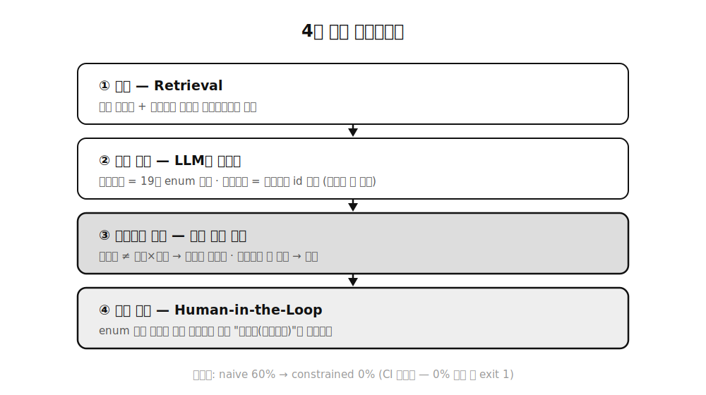

위험성평가서라는 문서가 있습니다. 중대재해처벌법과 산업안전보건법이 요구하는 법정 문서인데요. 작업 단계마다 위험요인을 찾고 재해유형을 분류하고 빈도×강도로 위험도를 계산하고 안전조치를 붙이는 구조입니다. 이걸 RAG로 자동 생성하는 시스템을 만들었어요.

문제는 이 도메인에서 환각이 그냥 "품질 이슈"가 아니라는 겁니다. 법정 문서에 존재하지 않는 안전조치나 틀린 위험도가 들어가면 그대로 부적합 판정 사유가 돼요. 그래서 접근을 뒤집었습니다. 환각을 사후에 잡는 게 아니라, **환각이 나올 수 있는 출력 공간 자체를 닫는** 설계로요.

## 🎯 자유생성이 틀리는 지점들

일반적인 RAG는 검색한 문서를 컨텍스트에 넣고 LLM에게 자유롭게 쓰게 합니다. 이 방식으로 위험성평가서를 만들면 어디서 틀리는지 보면요.

재해유형을 그럴듯하게 작문합니다. 표준 분류에 없는 유형을요. 안전조치도 지어냅니다. 근거 법령이 없는 조치가 문서에 박혀요. 제일 심각한 건 계산인데요. 빈도 3에 강도 4를 곱해놓고 위험도를 15라고 쓰는 식입니다. LLM은 곱셈도 틀리거든요.

## 🔒 설계 — 닫힌 정답 공간

그래서 항목마다 LLM의 자유도를 다르게 줄였습니다.

재해유형은 작문이 아니라 **표준 19종 enum 중 분류만** 하게 합니다. enum 밖의 답은 구조적으로 존재할 수 없어요. 안전조치는 **카탈로그에서 id로 선택만** 하게 합니다. 조치마다 법적 근거 조문이 딸려 있고, 맞는 게 없으면 빈 배열을 내는 게 정답이에요. 그리고 위험도 계산은 LLM에게서 완전히 회수했습니다. 빈도×강도 곱셈과 등급 매트릭스 룩업은 코드가 합니다. 계산을 잘하게 프롬프트를 다듬는 게 아니라 계산을 시키지 않는 거예요.

그 위에 결정론적 검증 레이어가 돕니다. 위험도가 빈도×강도와 다르면 코드가 재계산하고 재해유형이 enum 밖이면 자동 판단하지 않고 "미분류(검증보류)"로 사람에게 회부하고, 카탈로그에 없는 조치는 제거합니다. 마지막 판단은 사람 몫으로 남기는 게 이 도메인에선 기능이지 한계가 아니라고 봐요.

## 📊 환각률 60% → 0%

측정 없이는 주장일 뿐이라서 회귀 평가를 만들었습니다. Mock provider에 환각 3종(작문 재해유형, 근거 없는 조치, 틀린 계산)을 결정론적으로 주입하고 두 모드를 돌려요.

naive 모드(자유생성 그대로)는 환각률 60%가 나옵니다. constrained 모드는 0%고요. 여기서 0%의 의미가 중요한데요. "요즘 모델이 좋아져서 환각이 줄었다"가 아닙니다. 재해유형은 enum 밖으로 나갈 수 없고, 조치는 카탈로그 밖에서 올 수 없고, 계산은 코드가 하니까 **통계가 아니라 설계상 보장**이에요. 이 평가는 CI 게이트로도 물려 있어서 constrained 모드 환각이 0%보다 크면 빌드가 exit 1로 죽습니다. 리팩토링하다가 방어선을 실수로 무너뜨리면 배포 전에 걸리는 거죠.

## 🧼 덤 — 클린룸으로 다시 만들기

이 시스템은 원래 회사에서 만들었던 걸 포트폴리오용으로 다시 구현한 겁니다. 원본 코드는 열지 않고 스펙 문서만 보고 처음부터 재작성하는 클린룸 방식으로요. 덕분에 설계가 더 단순해졌습니다. Python 표준 라이브러리만으로 의존성 0을 유지했고 LLM provider는 Mock과 실모델을 드롭인으로 교체할 수 있게 추상화했어요. 키가 없어도 평가 파이프라인 전체가 Mock으로 재현됩니다.

## 🎁 정리

고위험 도메인의 RAG는 LLM을 더 똑똑하게 만드는 문제가 아니라 **덜 자유롭게 만드는 문제**였습니다. 출력은 닫힌 집합으로, 검증은 결정론적 규칙으로, 애매한 건 사람에게로. 프롬프트로 "환각하지 마세요"라고 부탁하는 것과 환각이 통과할 수 없는 파이프라인을 짜는 것의 차이가 60%와 0%의 차이였네요.
