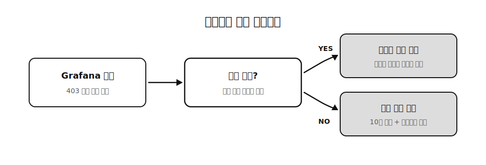

예전에 외주로 크롤러를 하나 만들었습니다. 대형 중고거래 플랫폼의 매물을 실시간으로 모니터링해서 특정 가격대 매물을 빨리 찾아주는, 의뢰받은 개인화 도구였는데요. 전국 532개 지역을 10분 주기로 갱신해야 했습니다. 문제는 프로덕션 서버가 라즈베리파이 4GB 한 대였다는 거예요.

이 프로젝트를 돌아보면 결론이 하나로 모입니다. **제약이 아키텍처를 만든다.** 4GB라는 물리적 천장 때문에 스택을 두 번 갈아엎었고 마지막에는 크롤러의 태도까지 바뀌었거든요. 그 과정을 정리해봅니다.

## 🧱 1막 — 첫 번째 벽: 메모리

처음엔 다들 하는 대로 Playwright 동적 크롤링으로 시작했습니다. 그런데 인스턴스당 메모리가 GB급(2~4GB)이었어요. 파이의 총 RAM이 4GB인데요. 그러니까 **크롤러 한 개가 서버를 통째로 먹는** 상황입니다. OS 올리기 전에 이미 초과예요. 다중화는커녕 한 개도 제대로 못 돌립니다.

여기서 질문을 바꿨습니다. 나한테 필요한 게 브라우저 렌더링 결과인가, 아니면 데이터인가? 데이터였어요. 그래서 브라우저를 버리고 HTTP 직접 요청(Node + axios)으로 전환했습니다. 메모리가 GB급에서 170MB 수준으로 내려왔어요.

## 🔀 1막 — 두 번째 벽: 동시성 모델

메모리는 잡혔는데 이번엔 처리 방식이 병목이 됐습니다. 이 워크로드는 수백 지역의 동시 I/O에다가 매물마다 파싱(CPU 작업)이 섞여 있거든요. Node는 단일 이벤트 루프라서 CPU 파싱이 루프를 막고 파이의 4코어 중 1코어만 씁니다. cluster나 worker_threads로 우회할 수는 있는데, 관리가 복잡해지고 동시성을 올릴수록 메모리가 불안정해졌어요.

그래서 Go로 갔습니다. 고루틴이 멀티코어를 자동으로 활용하고 동시성 단위당 메모리가 아주 작아요. 저비용 병렬과 안정적인 메모리를 한 번에 얻은 거죠. 인스턴스당 30MB까지 내려왔는데, 이건 재현 추정이 아니라 프로덕션 실측입니다.

세대별로 정리하면 이렇게 됩니다.

| 세대 | 스택 | 인스턴스당 메모리 |
|---|---|---|
| 1세대 | Playwright | GB급 (2~4GB) |
| 2세대 | Node HTTP | ~170MB |
| 3세대 | Go (고루틴 + Docker) | **~30MB** |

GB급에서 30MB로, 100배 안팎의 절감인데요. 이 밀도 덕분에 4GB 파이 한 대에 Go 크롤러 12개 + PostgreSQL/PostGIS + Redis + UI까지 전부 올라갔습니다. 성능의 승리라기보다 **밀도의 승리**에 가까워요.

## 🛑 2막 — 적이 바뀌다: 레이트리밋, 그리고 자기절제

메모리 전쟁이 끝나니까 적이 바뀌었습니다. 10분마다 짧은 크롤(실제 수집은 몇 초)이 도는데, 532개 요청이 짧게 몰리면 CDN의 분당 한도에 걸리고 동일한 요청 패턴은 악성으로 판정당해요.

처음엔 순진하게 접근했습니다. 요청을 가우시안 분포로 시간창에 퍼뜨려서 버스트를 없애는 것부터요. 그런데 그렇게 해도 403이 남았습니다. 재밌는 건 로그였는데요. Grafana로 403 추이를 쌓아보니 **우리 요청량과 무관하게 일정한 패턴으로** 403이 뜨는 구간이 보였어요. 이건 우리가 차단당한 게 아니라 상대 서버가 힘들어하는 전조라고 해석하게 됐습니다.

여기서 크롤러의 철학을 바꿨어요. "안 걸리는 크롤러"가 아니라 **"상대가 힘들면 물러나는 크롤러"**로요. 주식 시장의 서킷 브레이커처럼, 403 비율이 임계를 넘으면 크롤링을 스스로 유휴 상태로 전환합니다. 상대 서버가 회복할 시간을 주는 거예요. 갱신이 조금 늦는 것보다 수집원 자체가 죽는 게 훨씬 큰 손실이거든요.

덧붙이면, 이 크롤러가 모은 데이터는 재게재나 재판매 없이 단일 사용자의 구매 판단에만 쓰였습니다. 크롤링 관련 판례들을 찾아보면 문제가 되는 핵심이 수집한 데이터의 재배포던데, 그 지점을 만들지 않는 게 이런 도구를 만들 때 중요한 선이라고 생각해요.

## 🎁 배운 것

첫째, 제약은 생각보다 좋은 설계자입니다. 서버가 넉넉했으면 Playwright 그대로 뒀을 거예요. 4GB 천장이 있었기 때문에 "렌더링이 정말 필요한가"라는 질문까지 내려갈 수 있었습니다.

둘째, 전환의 이유는 매번 달랐습니다. Playwright에서 HTTP로 간 건 메모리 때문이고, Node에서 Go로 간 건 동시성 모델 때문이에요. 같은 "가벼워지기"로 뭉뚱그리면 두 번째 전환이 설명이 안 됩니다. 170MB에서 30MB 아끼자고 언어를 바꾸진 않거든요.

셋째, 오래 돌 크롤러의 핵심 역량은 회피가 아니라 절제더라구요. 관측(Grafana) 위에 세운 서킷 브레이커가 이 시스템에서 제일 마음에 드는 부분입니다.
