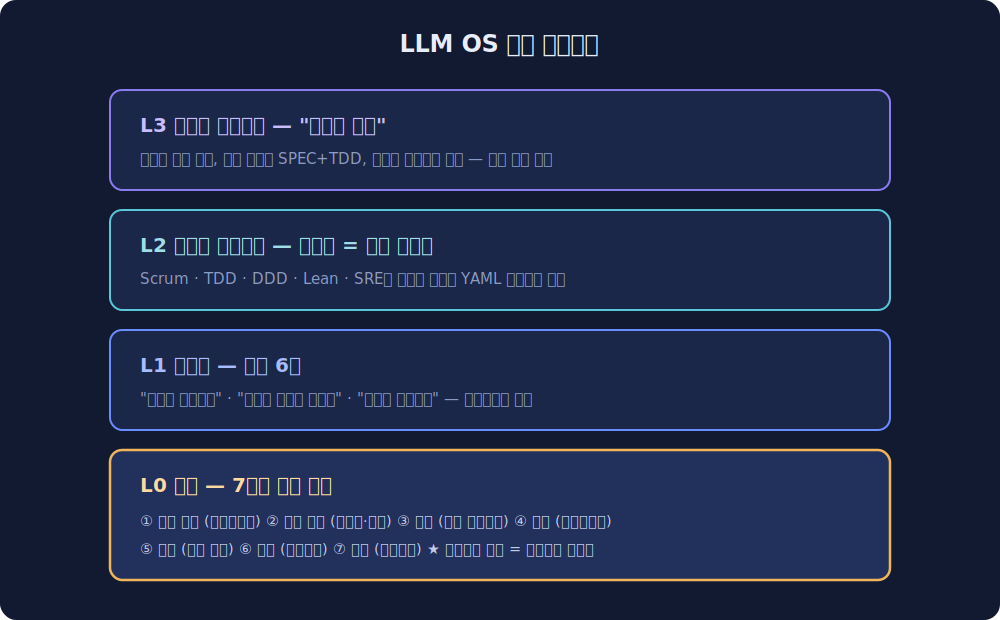
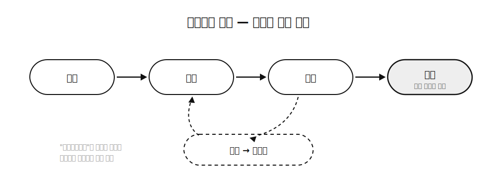
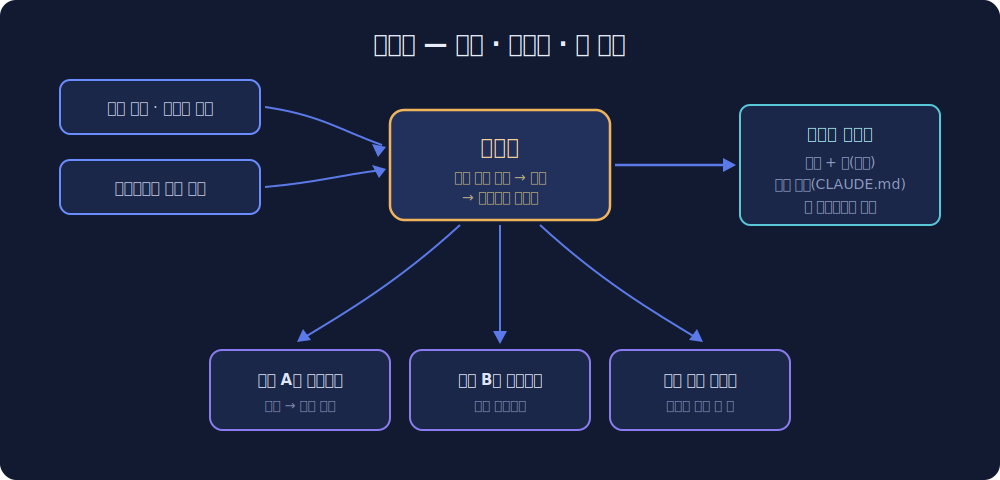

지난 글에서 LLM 위키 얘기를 했는데요. 에이전트가 읽고 쓰는 문서를 어떻게 쌓을까에 대한 글이었습니다. 그런데 쓰면서 계속 마음에 걸리는 게 있었어요. 위키는 사실 더 큰 그림의 한 조각이거든요. 기억 문제를 해결해도 에이전트는 여전히 약속을 안 지키고, 검증 없이 "완료했습니다!"를 외치고, 같은 실수를 반복합니다. 문서만으로는 팀이 안 되더라구요.

그래서 요즘 설계하고 있는 게 있습니다. 이름을 아직 못 정해서 일단 **LLM OS**라고 부르는데요. "에이전트에게 개발팀의 일을 통째로 맡기려면 뭘 만들어야 하나"에 대한 제 나름의 답입니다. 아직 컨셉 문서 단계지만 방향은 잡혀서, 이번 글에서 정리해보려고 해요.

## 🚩 워크플로우를 복제하는 도구들의 한계

에이전트 개발 도구들을 한동안 뜯어봤습니다. MoAI-ADK는 꽤 깊게 분석했고, AWS Kiro, GitHub Spec Kit, BMAD도 살펴봤는데요. 공통 패턴이 보였습니다. 전부 spec을 쓰고 → plan을 세우고 → 실행하고 → 문서를 동기화하는 **파이프라인**이에요. 팀의 "절차"를 복제한 거죠.

문제는 팀의 진짜 기능이 절차 바깥에 있다는 점입니다. 누가 뭘 하기로 했는지 추적하는 것, 왜 이렇게 설계했는지 기억하는 것, 실패했을 때 규칙 자체를 고치는 것. 이런 건 파이프라인 어디에도 없거든요.

MoAI 분석에서 본 숫자가 이 한계를 잘 보여주는데요. 규칙 문서가 62개, 800KB까지 불어나면서 서로를 참조하다가 폭주했습니다. 자가 진화 기능은 만들어져 있었는데 실제로 가동된 흔적이 0건이었어요. 규칙을 늘리는 건 쉽지만, 규칙이 스스로를 관리하게 만드는 건 어렵다는 거죠.

## 🧩 팀은 절차가 아니라 기능의 묶음이다

관점을 바꿔서 개발팀이 하는 일을 절차가 아니라 **기능**으로 분해해봤습니다. 일곱 개가 나왔어요. 의도 형성, 설계 숙의, 검증, 조정, 기억, 학습, 통치.

재밌는 건 각 기능마다 수십 년 묵은 학문 기반이 이미 있다는 겁니다. 의도 형성에는 소크라테스 문답법이 있고 검증에는 포퍼의 반증주의가 있어요. 조정에는 언어행위론, 기억에는 웨그너의 교류 기억 이론, 학습에는 아지리스의 이중고리 학습, 통치에는 오스트롬의 공유지 관리 원칙이 있습니다. 에이전트 연구 쪽에서 이미 검증된 것도 있는데요. 반증주의 기반 검증이나 변증법식 역할 토론은 논문이 나와 있습니다. 반면 조정, 기억, 학습, 통치 네 개는 어떤 에이전트 도구도 제대로 건드리지 않았어요. 절반이 빈 땅인 셈이죠.

이 관점에서 보면 기존 방법론들은 경쟁 대상이 아닙니다. Scrum은 의도 큐 + 케이던스 + 회고의 묶음이고, TDD는 검증 기능의 특정한 바인딩이고, DDD는 언어와 기억 경계에 대한 답이거든요. 어떤 단일 방법론도 일곱 기능을 전부 커버하지 못합니다. 그래서 전통 팀들이 항상 방법론을 조합해서 썼던 거예요. Scrum 하면서 TDD 하고 그 위에 SRE 프랙티스를 얹는 식으로요.

## 💿 OS 은유

여기까지 오면 구조가 자연스럽게 나옵니다. 운영체제예요.

맨 아래에 **커널**이 있습니다. 일곱 개 인식 기능이 프리미티브로 들어가요. 그 위에 **헌법**이 있습니다. 어떤 방법론도 오버라이드할 수 없는 원칙 몇 개인데, "발화는 계약이다", "합의는 진실이 아니다", "규칙은 공유지다" 같은 것들이에요. 그 위에 **방법론 프로파일**이 있습니다. Scrum, TDD, DDD가 코드가 아니라 커널 설정값 선언(YAML)으로 존재해요. 맨 위에 **디스패처**가 있습니다. 작업이 들어오면 분류해서 맞는 프로파일을 바인딩하는 층이죠.

디스패처가 제가 제일 아끼는 부분인데요. 방법론을 프로젝트 단위로 고정하지 않고 **작업 단위**로 고릅니다. 재현 케이스가 있는 버그면 인터뷰와 스펙을 생략하고 재현 우선으로 가요. 외부 동작이 바뀌는 신규 기능이면 스펙 + TDD + 이중 게이트를 다 태우고요. 오타 수정이면? 디스패치 자체를 생략합니다. OS 스케줄러가 정책을 고르는 것처럼요. 모든 작업에 같은 무게의 프로세스를 태우는 게 기존 도구들의 고질병인데, 그걸 커널 수준에서 막는 겁니다.

커널의 1급 프리미티브로 밀고 있는 건 **커밋먼트 원장(Commitment Ledger)**입니다. 에이전트의 모든 약속과 완료 선언을 요청 → 약속 → 이행 → 인수의 상태 기계로 등록하고 추적해요. OS로 치면 프로세스 테이블에 해당합니다. "완료했습니다"라는 발화가 증거를 제출하고 청산되기 전까지는 미결 약속으로 남는 거죠. 이론 계보는 위노그라드와 플로레스의 1986년 작업까지 올라가는데, 에이전트가 말로만 일을 끝내는 문제에 이만큼 정확히 맞는 프레임을 아직 못 봤어요.

## 🏰 넥서스 — OS에는 배포판이 필요하다

여기까지가 개발자 한 명의 머신에서 돌아가는 그림이라면, 남은 질문은 팀입니다. 이 설정값들을 누가 관리하고 어떻게 팀 전체에 깔까요?

그래서 같이 구상하는 게 **넥서스**입니다. 팀의 개발 규칙을 중앙에서 정의하고 스킬과 훅과 규칙 파일로 컴파일해서 팀원 전체의 에이전트에 배포하는 허브예요. 네, 게임에서 모든 유닛이 모이는 그 넥서스 맞습니다. 목표는 신규 팀원 온보딩이 저장소 클론 한 번으로 끝나는 것. 클론하면 팀의 방법론 프로파일이 에이전트에 자동으로 물리는 거죠.

조사하면서 확인한 건데, 이 결합 지점이 비어 있더라구요. 규칙을 강제하는 도구는 있습니다. 규칙을 배포하는 도구도 있어요. 그런데 프로파일을 정의하면 강제 장치와 규칙 파일이 같이 컴파일되어서 팀 레지스트리로 배포되는 물건은 없습니다. 강제 생태계와 배포 생태계가 서로 모른 채 따로 자라고 있는 상황이에요.

넥서스에서 하나 더 중요한 결정이 있는데요. 새 방법론을 파는 게 아니라 **기존 규칙을 추출**한다는 겁니다. 팀들은 새 프로세스를 배우고 싶어하지 않아요. 이미 린터 설정과 컨벤션 문서와 코드베이스 관례로 규칙을 갖고 있거든요. 넥서스의 위저드는 그걸 스캔해서 확인받고 강제 형태로 컴파일하는 물건이어야 합니다. 프로세스를 강요하는 도구는 계속 실패해왔어요. 이미 있는 규칙을 AI에게 물려주는 도구여야 한다고 생각합니다.

## 🗺️ 지금 어디까지 왔나

솔직하게 적으면 컨셉 문서와 리서치 보고서까지입니다. 코드는 없어요 😅 검증된 뼈대(의도 형성, 숙의, 검증)로 시작하고, 커밋먼트 원장 하나만 정체성으로 깊게 파고 나머지는 최소 구현으로 간다는 전략까지는 정해뒀습니다. 첫 구현은 Claude Code 플러그인 형태가 유력하고, 레퍼런스 프로파일은 1인 개발자용부터 만들어서 제 프로젝트에 도그푸딩해볼 생각이에요.

지난 글의 [LLM 위키](/posts/llm-wiki/)는 이 그림에서 다섯 번째 기능, 그러니까 기억의 조각이었습니다. 색인 우선 원칙도 거기서 나온 거였어요. 앞으로 조각이 하나씩 만들어질 때마다 여기에 적으려고 합니다. 다음 글은 아마 커밋먼트 원장 상세 설계가 될 것 같네요.
