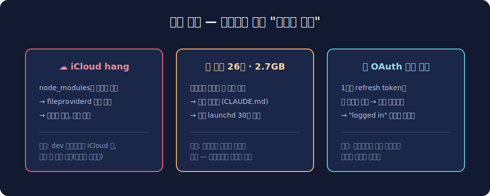

책상 구석의 Mac mini 한 대가 제 홈서버입니다. 모니터도 키보드도 없이 Tailscale로만 접속하는 헤드리스 머신인데요. AI 에이전트가 상주하면서 일하고 사이드 프로젝트 사이트 여러 개가 올라가 있고 Cloudflare 터널로 외부에 공개되어 있습니다. 몇 달 운영하면서 서버를 세 번쯤 곤란하게 만들었는데, 그 사건들이 셋업 설명보다 유익할 것 같아서 같이 적어봅니다.

## 🏗️ 스택 — 프로세스는 세 부류로 나눈다

서비스 관리는 성격에 따라 세 갈래로 나눴습니다.

죽으면 안 되는 상주 데몬은 **launchd**에 둡니다. macOS 네이티브 서비스 매니저인데요. KeepAlive를 걸어두면 부팅 자동 시작에 크래시 자동 재시작까지 OS가 책임져줍니다. AI 게이트웨이처럼 항상 살아 있어야 하는 것들이 여기 삽니다.

교체가 잦은 웹 서비스들은 **PM2**로 굴립니다. 정적 사이트 서빙, 게임 도구, 그리고 Cloudflare 터널 프로세스 자체도 PM2 밑에 있어요. pm2 save 한 번이면 재부팅 후 복원되고, 뭔가 이상하면 pm2 logs로 바로 봅니다.

외부 공개는 전부 **Cloudflare 터널**입니다. 공유기 포트포워딩 없이 아웃바운드 연결 하나로 도메인들이 집 서버에 물려요. ingress 설정 파일에 호스트와 로컬 포트 매핑만 추가하면 새 사이트가 열립니다. 집 IP는 어디에도 노출되지 않고요.

여기서 배운 원칙 하나. 같은 프로세스를 두 매니저에 이중 등록하면 사고가 납니다. 게이트웨이를 launchd에 두고 실수로 PM2에도 올렸더니, 단일 인스턴스 lock을 서로 뺏으면서 크래시 루프가 돌았어요. 프로세스마다 주인은 하나여야 합니다.

## 💥 사건 1 — iCloud가 서버를 멈춘 날

최악의 장애는 의외의 곳에서 왔습니다. iCloud Drive요.

macOS는 기본으로 데스크탑과 문서 폴더를 iCloud에 동기화하는데요. 데스크탑에 놔둔 개발 프로젝트에서 빌드를 돌린 게 화근이었습니다. node_modules가 통째로 iCloud 동기화 대상이 된 거예요. pnpm의 심링크 구조를 동기화 데몬(fileproviderd)이 소화하지 못하고 무한 루프에 빠졌고 CPU와 디스크와 로그가 폭주하다가 시스템이 멎었습니다. SSH도 Tailscale도 같이 죽어서 원격 복구가 불가능했고 결국 물리 전원을 뽑아야 했어요. 헤드리스 서버에서 제일 굴욕적인 순간이죠.

교훈은 둘입니다. 개발 프로젝트는 무조건 iCloud 동기화 범위 밖에 둘 것. 그리고 원격 서버가 통째로 멎는 시나리오에는 SSH가 아니라 스마트 플러그 같은 대역 외 수단이 필요하다는 것.

## 🌪️ 사건 2 — 헤드리스 크롬 26개가 쌓이던 날

에이전트가 스크린샷이나 스크래핑으로 헤드리스 크롬을 자주 띄우는데, 이게 작업 후에 안 죽고 쌓이는 문제가 있었습니다. 어느 날 보니 크롬 프로세스 26개가 2.7GB를 먹고 있고 /tmp에는 일회용 크롬 프로필 122개가 뒹굴고 있더라구요.

대응은 이중으로 했습니다. 원칙은 "띄운 세션이 직접 닫는다"로 잡고, 규칙 문서에 명문화했어요. mktemp로 프로필을 만들고 작업이 끝나면 kill과 삭제까지 책임지는 패턴으로요. 그리고 안전망으로 리퍼 스크립트를 launchd에 30분 주기로 걸었습니다. 60분 넘은 헤드리스 크롬을 정리하고 고아가 된 프로필 디렉토리를 청소하는 스크립트예요.

이 사건이 재밌는 건, 해결책의 핵심이 코드가 아니라 문서였다는 점입니다. 규칙을 CLAUDE.md에 적어두니 에이전트가 알아서 지키기 시작했거든요. 지난 글에서 쓴 LLM 위키가 실제로 서버 운영 문제를 해결한 사례입니다.

## 🔑 사건 3 — "로그인됨"을 믿으면 안 된다

AI 게이트웨이는 ChatGPT OAuth 크리덴셜을 쓰는데, 어느 날 갑자기 인증이 죽었습니다. 원인이 교묘했는데요. OpenAI의 refresh token은 1회용 rotation 방식입니다. 갱신할 때마다 새 토큰으로 바뀌고 옛 토큰은 무효가 돼요. 그런데 같은 계정 토큰을 CLI 도구와 게이트웨이가 공유하고 있었던 겁니다. 한쪽이 토큰을 갱신하는 순간 다른 쪽이 들고 있던 토큰은 "재사용된 토큰"으로 거부당해요. 서로가 서로를 로그아웃시키는 구조였던 거죠.

더 고약한 건 진단이었습니다. 상태 명령은 크리덴셜 항목이 존재하기만 하면 "logged in"을 출력하거든요. 죽은 토큰인지는 안 봐요. 그래서 지금은 인증 상태를 확인할 때 상태 표시를 믿지 않고 실제 원샷 호출을 날려서 검증합니다. 헬스체크는 상태 플래그가 아니라 실동작으로 해야 한다는 걸 다시 배웠어요.

## 📊 관측 — 대시보드는 설정 파일을 읽게 한다

서비스가 늘어나니까 뭐가 살아 있는지 한눈에 볼 게 필요해졌습니다. 그래서 의존성 없는 Node 스크립트로 상태 대시보드를 만들어 터널에 물렸는데요. 설계에서 마음에 드는 부분은 등록 절차가 없다는 겁니다.

대시보드가 Cloudflare 터널의 ingress 설정을 실시간으로 파싱해서 호스트 목록을 얻고 호스트별로 로컬 헬스체크를 돌립니다. 포트와 프로세스 매핑은 lsof로 추적하고요. Docker 컨테이너와 launchd 커스텀 서비스도 같이 보여줍니다. 새 사이트를 ingress에 추가하면 대시보드에 자동으로 나타나요. 설정의 원본(SSOT)이 이미 터널 설정 파일에 있는데 대시보드용 목록을 따로 관리하면 언젠가 둘이 어긋나거든요.

## 🎁 정리

몇 달 굴리면서 얻은 결론은 이렇습니다. 홈서버의 적은 하드웨어가 아니라 **쌓이는 것들**이에요. 안 죽은 프로세스, 눈치 없는 동기화 데몬, 조용히 썩는 크리덴셜. 그리고 그 방어는 대부분 코드가 아니라 규칙과 관측이었습니다. 규칙은 문서로 만들어 에이전트가 지키게 하고, 상태는 원본 설정에서 파생시키고, 최후의 보루로 리퍼와 스마트 플러그를 둔다. 4만 원짜리 전기요금으로 이만한 놀이터가 없네요.
