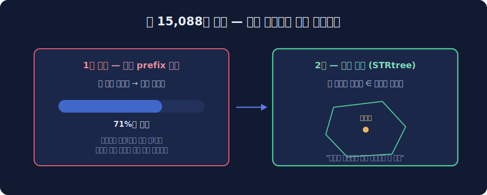

React에서 한국 지도를 그려야 할 일이 있었는데요. 찾아보니 쓸 만한 게 없었습니다. southkorea-maps는 2018년에 업데이트가 멈췄고 react-simple-south-korea-map-chart는 SVG로 시도 단위까지만 그려줘요. 실제 지도 타일 위에 행정 경계를 얹고 시도에서 시군구, 행정동, 리(里)까지 파고 내려가는 물건은 없더라구요. 그래서 만들었습니다. **mapcn-kr**이에요.

mapcn이라는 프로젝트가 있습니다. shadcn/ui 스타일로 지도 컴포넌트를 제공하는 건데요. 그 위에 대한민국 행정구역 레이어를 얹는 컴포넌트를 만들어서 shadcn 레지스트리로 배포했습니다. 설치는 한 줄이에요.

```bash
npx shadcn@latest add https://raw.githubusercontent.com/DevMinGeonPark/mapcn-kr/main/public/r/korea-map.json
```

이러면 `components/ui/korea-map.tsx`가 프로젝트에 복사됩니다. npm 패키지가 아니라 **코드가 통째로 들어오는 방식**이라 수정도 자유예요. shadcn 레지스트리의 이 배포 모델이 지도처럼 커스터마이징 요구가 많은 컴포넌트랑 잘 맞는다고 생각했습니다. mapcn의 map 컴포넌트도 의존성으로 자동 설치돼요.

## 🗺️ 데이터 가공 — 경계 파일 만들기

행정 경계 데이터는 admdongkor의 행정동 GeoJSON에서 시작했습니다. 이걸 mapshaper로 dissolve해서 세 단계를 만들어요. 시도 16개, 시군구 256개, 행정동 3,558개. 2026년 데이터라 광주+전남 통합도 반영되어 있습니다(그래서 시도가 17개가 아니라 16개예요).

여기까지는 순탄했는데, 리(里)에서 일이 커졌습니다.

## 🧩 리 15,088개 — 코드 매칭이 배신할 때

리 경계는 행안부 SHP에서 가져왔는데 15,088개입니다. 처음엔 단순하게 생각했어요. 행정구역 코드는 계층 구조니까 리 코드의 앞자리(prefix)로 상위 행정동에 붙이면 되겠지, 하고요.

결과는 **71%만 매칭**. 나머지 29%는 코드로 부모를 못 찾았습니다. 원인은 코드 드리프트였어요. 행정구역은 계속 개편되거든요. 화성시 분구 같은 사건이 있을 때마다 코드가 재배정되는데, 리 데이터(2023)와 행정동 데이터(2026)의 기준 시점이 다르니까 prefix가 어긋나는 겁니다.

그래서 코드를 버리고 공간으로 풀었습니다. shapely의 STRtree로 리 폴리곤의 중심점이 어느 읍면동 폴리곤 안에 떨어지는지 공간 매칭한 거예요. 코드가 어긋나 있어도 땅은 거짓말을 안 하니까요. 이 방식으로 리 전체가 연결됐고 행정동 쪽엔 리가 있는지 표시하는 has_ri 플래그를 심어서 드릴다운 UI가 미리 알 수 있게 했습니다.



## 📦 용량과의 싸움

경계 데이터는 무겁습니다. 전국 데이터를 다 합치면 수십 MB라 프론트에 그냥 얹을 수 없어요. 두 가지로 풀었는데요.

하나는 TopoJSON입니다. GeoJSON은 인접 폴리곤이 경계선을 중복 저장하는데 TopoJSON은 공유 경계를 한 번만 저장해요. quantization까지 걸면 12MB가 5.9MB로 내려갑니다. 다른 하나는 시도별 청크 lazy-fetch예요. 리 데이터는 시도 단위로 쪼개두고 사용자가 그 시도로 드릴다운할 때만 가져옵니다. 데이터는 전부 jsDelivr CDN에서 서빙해서 레지스트리 컴포넌트만 받으면 바로 동작해요.

## 🚀 마무리

라이브 데모는 devmingeonpark.github.io/mapcn-kr 에 있고, 코드는 GitHub(DevMinGeonPark/mapcn-kr)에 공개했습니다. 시도를 클릭하면 시군구로, 시군구에서 행정동으로, 리가 있는 곳은 리까지 내려가요. 경계는 베이스맵의 라벨 레이어 아래에 삽입해서 도로명이나 지명이 항상 위에 보이게 했습니다.

만들면서 다시 확인한 건데, 국내 행정구역 데이터는 "구하기"보다 "잇기"가 어렵습니다. 데이터 자체는 공개되어 있는데 기준 시점이 제각각이라 조인이 항상 말썽이에요. 코드 매칭이 71%에서 멈췄을 때 공간 매칭으로 우회한 게 이 프로젝트에서 제일 재밌는 결정이었네요. 다음 로드맵은 읍면동 PMTiles와 choropleth helper입니다.
