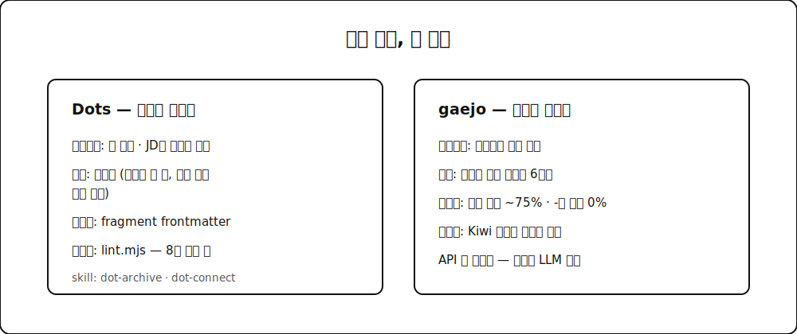

요즘 저를 위한 개인 도구를 몇 개 만들었는데, 완성하고 보니 공통점이 있었습니다. 전부 엔진이 없어요. 핵심 로직이라고 부를 만한 코드가 없습니다. 변환도 생성도 조립도 전부 에이전트(LLM)가 하고, 제가 만든 건 규칙 문서와 스키마와 검증 게이트뿐이에요. 도구를 만드는 방식이 바뀌고 있다는 생각이 들어서, 두 개를 예로 정리해봅니다.

## 🧷 Dots — 이력서를 점과 선으로

이력서 관리는 늘 괴로웠습니다. 회사마다 다른 이력서를 내야 하는데, 그때마다 옛 이력서를 복사해서 고치다 보면 버전이 갈라지고 어떤 게 최신인지 모르게 되거든요.

그래서 만든 게 **Dots**입니다. 컨셉은 점잇기 퍼즐이에요. 이력의 파편(프로젝트, 성과, 경력)을 점으로 아카이브해두고, 지원할 회사의 JD가 오면 거기 맞는 점들을 골라 이어서 이력서를 조립합니다. 잡스의 "점은 돌아봐야 이어진다"에서 이름을 가져왔어요.

구현체가 뭐냐면, 앱이 아닙니다. Claude Code 스킬 두 개예요. dot-archive는 프로젝트가 끝날 때 "점 찍자"고 하면 정해진 스키마(frontmatter)로 파편을 기록하고 dot-connect는 JD를 주면 아카이브에서 점을 골라 타깃별 이력서를 조립합니다. 사람이 하는 건 대화뿐이에요.

대신 규칙은 코드처럼 엄격하게 걸었습니다. 하네스에 불변식을 선언해두고 lint 스크립트가 검증 게이트로 돌아요. 제일 중요한 불변식은 두 개인데요. 데이터의 유일한 진실은 한 디렉토리뿐이고 복제본을 만들지 않는다는 것, 그리고 증거(공개 링크, 문서) 없는 정량 성과는 이력서에 쓰지 않는다는 것. 실제로 마이그레이션한 40개 파편 중 8개가 "성과 수치는 있는데 증거가 없음" 경고로 보류 상태입니다. 창작 금지 원칙이 게이트로 강제되는 거죠.

## ✂️ gaejo — 개조식은 형태소로 검증한다

한국 연구 발표 슬라이드는 완전문장으로 안 씁니다. "우리는 정확도를 4.7%p 정도 끌어올렸습니다"가 아니라 "정확도 약 4.7%p 향상"으로, 명사로 끊어 압축하는 개조식(箇條式)이 관례예요. 그런데 슬라이드 초안을 LLM에 맡기면 십중팔구 말하듯 풀어 씁니다.

**gaejo**는 이걸 다듬는 도구인데, 역시 변환 엔진이 없습니다. 변환은 Claude Code나 Codex 같은 에이전트가 해요. gaejo가 제공하는 건 두 가지입니다. 실제 한국 발표 슬라이드 코퍼스에서 도출한 개조식 6원칙(명사로 끝낸다, 인과는 기호로 외주화한다, 수치와 역접 뉘앙스는 버리지 않는다 등), 그리고 Kiwi 형태소 분석기로 변환 결과를 결정론적으로 검증하는 게이트요.

검증을 형태소로 하는 게 포인트인데요. 개조식의 핵심은 어떻게 끝맺느냐(순수 명사냐, -ㅁ/음이냐, 완전문장이냐)에 있어서 영어권 지표(불릿당 단어 수 같은)로는 못 잡습니다. 코퍼스를 세어보니 명사 종결이 약 75%고 -기 종결은 0%였어요. 이런 통계가 규칙이 되고 규칙이 게이트가 됩니다. LLM 없이도 검증은 돌아가니까 API 키가 없어도 쓸 수 있어요.

## 🧩 패턴 — 코드 대신 규칙을 배포한다

두 도구를 겹쳐 보면 구조가 같습니다.

예전 도구는 입력을 받아 출력을 만드는 엔진 코드가 본체였어요. 지금은 에이전트가 그 자리를 차지합니다. 제가 만드는 건 세 가지예요. 에이전트가 읽을 규칙(무엇이 좋은 출력인가), 출력이 지켜야 할 스키마(어떤 모양이어야 하는가), 그리고 결정론적 검증 게이트(정말 지켰는가). 창의적인 일은 LLM이 제일 잘하고, 일관성은 코드가 제일 잘 지키니까 그렇게 나눈 겁니다.

이 블로그 글들도 사실 같은 패턴으로 만들어지고 있습니다. 초안은 에이전트가 쓰고 문체 규칙은 문서로 걸려 있고 AI 티 정량 진단과 변경률 게이트를 통과해야 발행돼요. 위험성평가 RAG에서 무협 페르소나 생성기까지, 요즘 만든 것들이 결국 전부 이 한 문장으로 수렴하네요. **엔진은 LLM, 제품은 규칙과 게이트.**

그리고 이 관점의 끝에는 지난번에 쓴 LLM OS 구상이 있습니다. 개인 도구 수준에서 반복되는 이 패턴을 팀 수준으로 올리면, 규칙과 게이트를 중앙에서 관리하고 배포하는 무언가가 필요해지거든요. 점이 또 하나 이어졌습니다.
