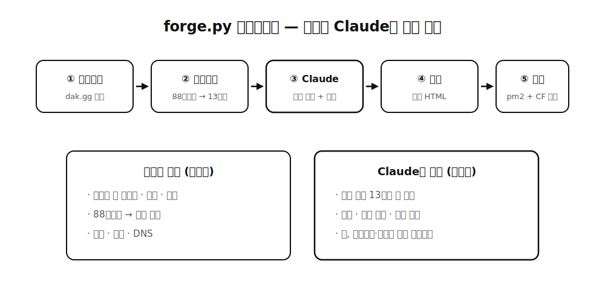

친구 전적 페이지를 보다가 이상한 생각이 들었습니다. 이 사람 모스트 캐릭터랑 플레이 스타일이면 무협 세계관에선 무슨 문파일까? 탱커 위주로 버티는 친구는 소림사고, 화려한 콤보만 노리는 친구는 화산파겠는데요. 이 실없는 생각을 그대로 파이프라인으로 만들었습니다. 이터널리턴 계정명을 넣으면 무협 문파 페르소나 사이트가 나오는 생성기, **wuxia-forge**예요.

동작은 명령 한 줄입니다.

```bash
python3 forge.py <계정명>
```

이러면 dak.gg 전적을 스크래핑하고 모스트 캐릭터 기반으로 문파를 정하고 Claude가 도호(道號)와 무공 별칭과 카피를 지어주고 단일 HTML로 렌더해서 Cloudflare 터널로 배포까지 끝납니다. 친구한테 링크만 던져주면 되는 거죠.

## ⚔️ 88캐릭터를 13문파로

먼저 세계관 매핑이 필요했는데요. 이터널리턴 캐릭터 88명을 무기와 성격 기준으로 13개 문파에 배정한 factions.json을 만들었습니다. 소림사, 무당파, 화산파, 점창파 같은 익숙한 문파들이에요. 문파마다 한자 인장(禪, 太, 梅…), 색 팔레트, 문파 설명, 티어 힌트까지 카탈로그로 정의해뒀습니다.

재밌었던 건 나중에 판타지판(arcane-forge)을 만들 때였는데요. 같은 88캐릭터를 이번엔 성기사단, 원소술사, 강령술사, 암살길드 같은 11개 세력으로 재분류했습니다. 같은 데이터에 세계관 렌즈만 바꿔 끼운 건데, 매핑 파일 하나 갈아끼우니 완전히 다른 물건이 나오더라구요.

## 🎨 역할 분담 — 코드는 디자인, Claude는 텍스트

이 프로젝트에서 제일 신경 쓴 결정은 LLM에게 뭘 맡기고 뭘 안 맡길지였습니다.

디자인 팔레트는 전부 코드가 통제합니다. 문파별 배경색, 강조색, 먹색 톤은 카탈로그에 하드코딩되어 있어요. Claude에게 색을 고르게 하면 어떤 날은 멋있고 어떤 날은 촌스러운 사이트가 나오거든요. 일관성이 필요한 건 코드로 못 박았습니다.

Claude가 하는 일은 두 가지예요. 전적 데이터를 보고 13문파 중 하나를 고르는 것(선택), 그리고 그 문파 세계관으로 도호·무공 별칭·소개 카피를 짓는 것(작문). 선택은 카탈로그 안에서만, 작문은 세계관 규칙 안에서만 하게 되어 있습니다. 호출은 API가 아니라 claude -p 커맨드라인 한 방이에요. 사이드 프로젝트에선 이 정도가 제일 가볍습니다.



지나고 보니 이 구조가 회사에서 만든 constrained RAG랑 같은 철학이었어요. 일관성이 필요한 곳은 닫힌 카탈로그, 창의성이 필요한 곳만 LLM. 법정 문서랑 무협 페르소나라는 극과 극의 도메인에서 같은 설계가 나온 게 재밌습니다.

## 🚀 렌더와 배포 — 단일 HTML의 힘

생성 결과는 프레임워크 없는 단일 HTML 파일입니다. 템플릿에 팔레트와 텍스트를 주입해서 파일 하나로 완결돼요. 수묵 배경에 한자 인장이 뜨고, 문파 색으로 물든 전적 카드가 깔립니다. 판타지판은 폰트부터 다르게 갑니다. Cinzel Decorative 같은 서양 장식 서체에 룬과 마법서 비주얼이에요.

배포는 pm2로 정적 서빙을 올리고 Cloudflare 터널의 ingress와 DNS를 스크립트가 자동으로 잡습니다. 계정명 하나 넣으면 몇 분 뒤에 서브도메인이 달린 사이트가 살아 있는 거죠. 집의 Mac mini가 서버라서 추가 비용도 없습니다.

## 🪤 삽질 노트 — 헤드리스 크롬과 무한 애니메이션

스크래핑과 캡처에서 자잘한 함정이 많았는데요. 두 개만 남겨둡니다.

헤드리스 크롬은 스크린샷을 찍고 나서도 프로세스가 안 죽는 경우가 있습니다. 그래서 백그라운드로 띄우고 결과 파일이 생겼는지 폴링한 다음 직접 kill하는 패턴으로 정착했어요. 그리고 사이트에 무한 CSS 애니메이션이 있으면 크롬의 가상 시간 예산 옵션이 영영 안 끝납니다. 애니메이션이 도는 동안 가상 시간이 계속 소비되거든요. 캡처할 땐 CSS로 animation을 꺼버리는 주입이 필요했습니다.

## 🎁 정리

쓸모로 시작한 프로젝트는 아닙니다. 그런데 만들고 나니 남는 게 많았어요. LLM 파이프라인에서 자유도를 어디까지 열지 정하는 감각, 매핑 파일만 바꾸면 세계관이 통째로 갈리는 데이터 설계, 그리고 명령 한 줄에서 배포까지 잇는 자동화 습관까지요. 친구들 반응이 제일 큰 보상이긴 했습니다. 자기 문파가 마음에 안 든다고 항의하던데, 그건 제 잘못이 아니라 전적 탓이에요.
